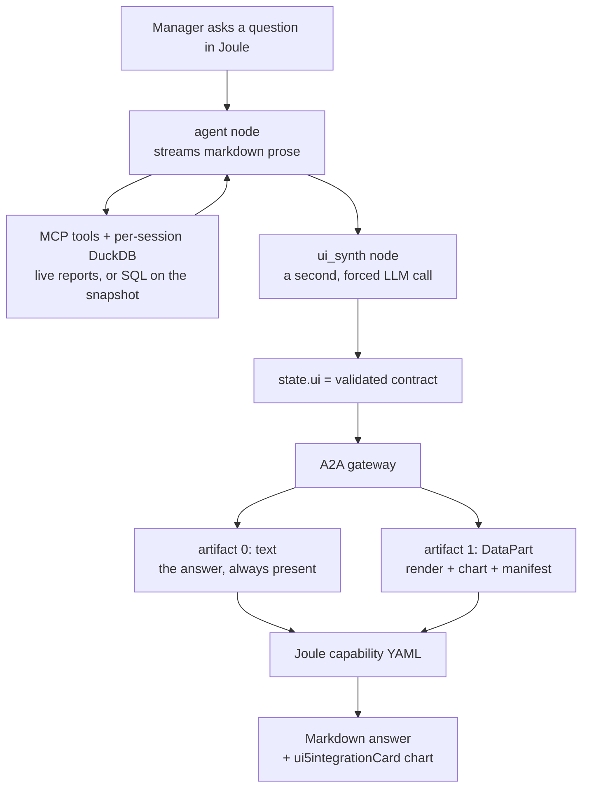

# Build pro-code AI Agents on SAP Business AI Platform

From your own data to a Joule-native experience.

Most AI agents stop at conversation. This repo is the harder, more useful thing:
an agent that reads real transaction data, reasons over it, and hands a manager
something they can act on — rendered as a chart inside Joule, in the flow of
work.

It is one agent, built end to end, in four stages:

| Stage | What it is | Where it lives |
|---|---|---|
| 1. Source | Real business data, already in a system of record | External — HANA Cloud / an application database |
| 2. Access | An MCP server is the only way in | [src/mcp_client.py](src/mcp_client.py) |
| 3. Reasoning | A pro-code LangGraph agent that picks tools and analyses rows | [src/agent/graph.py](src/agent/graph.py) |
| 4. Delivery | A Joule Skill that renders a generative UI | [src/ui_contract.py](src/ui_contract.py), [src/gateway/](src/gateway/), [joule/](joule/) |

Everything runs on SAP Business AI Platform: Gen AI Hub for the model, an MCP
server for data, the A2A protocol for invocation, and Joule for delivery.
LangGraph is the agent framework.

## The idea worth taking away

The obvious way to render a chart in Joule does not work.

Joule's capability YAML substitutes values with SpEL (`<? ... ?>`), and **SpEL
returns strings**. You cannot loop an array into chart rows or buttons from
YAML. Any design where the agent "describes a chart" in its reply dies here.

The way out is to stop treating narration and structure as one channel:



The agent writes prose and nothing else. A separate synthesizer then looks at
the *finished* turn and emits a small typed payload describing the widget that
should accompany it. Two consequences make this worth copying:

- **The answer streams immediately.** Structure is decided afterwards and never
  blocks the first token.
- **It degrades safely.** `text` is always present, so a client that ignores the
  structured part still shows a complete answer. A malformed payload falls back
  to text rather than reaching Joule half-built.

The payload is transport-agnostic — data, never markup — so the same agent can
feed Joule, a web app, or anything else by writing one adapter per client.

## Quickstart

Requires Python 3.11–3.13, an SAP AI Core service key, and reachable MCP server.

```bash
git clone <this repo> && cd joule-procode-agent-workshop

uv venv --python 3.12 .venv          # or: python -m venv .venv
uv pip install --python .venv/bin/python -e ".[gateway,dev]"

cp .env.example .env                 # then fill in AICORE_* and MCP_USER_EMAIL
```

Confirm the data layer before anything else — this is the single most common
cause of a broken demo:

```bash
.venv/bin/python scripts/probe_mcp.py
```

It prints the tools the MCP server actually exposes. Then run the two processes:

```bash
.venv/bin/langgraph dev                                     # agent  :2024
.venv/bin/uvicorn src.gateway.server:app --port 9000        # gateway :9000
```

Smoke-test the A2A endpoint:

```bash
./scripts/call_agent.sh "Which of my team members moved most on engagement last quarter?"
```

## Stage 1 — Source

Nothing in this repo. The data lives where it already lives: a HANA Cloud
schema, an application report, an HR data mart. The point of the exercise is
that the agent is built against data you already have, not a synthetic fixture.

For the worked example it is recognition data: who recognised whom, when, for
what reason, and an engagement index per person.

## Stage 2 — Access

[src/mcp_client.py](src/mcp_client.py)

The agent has no driver and no SQL against the live business system. Check
[pyproject.toml](pyproject.toml) — `duckdb` is listed for the local mart
below, not as a client of the system of record.

Everything arrives through an MCP server over SSE:

```
{MCP_BASE_URL}/mcp/sse?scope=analytics
```

Two design points do the real work:

**Identity travels with the request.** The manager's email goes in the
`x-mcp-user-email` header, and the server scopes every query to that person's
team. The agent cannot ask for someone else's data because it never writes the
query. This is also why tools are loaded per request rather than at import time.

**The agent sees a subset of the scope.** The `analytics` scope exposes nine
tools; `ALLOWED_TOOLS` narrows it to the two this agent needs. Reach it does not
need is surface it can get wrong.

That allowlist has a sharp edge worth showing: if the server renames a tool, the
name silently stops matching and the agent loses its data source — and an agent
without data tends to start guessing. So a missing allowlisted tool raises at
startup instead:

```python
missing = ALLOWED_TOOLS - by_name.keys()
if missing:
    raise RuntimeError(...)
```

This is a real bug from the production codebase, where an allowlist and a prompt
disagreed about whether a tool was called `get_award_reasons_data` or
`get_monetary_and_nonMonetary_award_reasons_data`.

### Local mart (text-to-SQL)

The two MCP tools are fixed reports. For questions that are easier as SQL
(windows, multi-column filters, ranking several measures at once) the graph
loads those reports into a **per-session** in-memory DuckDB when the
conversation starts, then `query_local_warehouse` compiles English to a
read-only query against that catalog.

Nothing is written to a CSV. Each LangGraph thread gets its own connection,
scoped to that manager's MCP pull. Later turns reuse it; a new conversation
loads again.

[src/warehouse/](src/warehouse/) · [tests/test_warehouse.py](tests/test_warehouse.py)

## Stage 3 — Reasoning

[src/agent/graph.py](src/agent/graph.py) · [src/agent/prompts.py](src/agent/prompts.py) · [src/config.py](src/config.py)

Deliberately no agent framework beyond LangGraph and no factory: the whole agent
is one readable file. Tools are assembled in `_tools_for`: the two MCP reports,
then `query_local_warehouse`.

```
START -> hydrate -> agent <-> tools
                      |
                      +----> ui_synth -> END
```

The model comes from Gen AI Hub, which resolves a model *name* against the
deployments in your AI Core resource group. Swapping providers is one file.

The graph binds the two MCP tools and `query_local_warehouse`. The warehouse
tool compiles the question to SQL — the agent is told not to write it.

**Grounding and guardrails** are the part that separates a demo from something
you would let a manager use:

- Every number must come from a returned row; the prompt forbids estimating and
  requires the agent to report an empty result as a finding rather than fill the
  gap.
- Internal identifiers never reach the user.
- The agent resolves relative dates ("last quarter") itself rather than
  interrogating the user.
- Tool access is allowlisted (Stage 2) and read-only — there is no write path.
- The agent is told a presentation layer exists, so it never emits JSON or chart
  definitions into the prose.

## Stage 4 — Delivery

### 4a. The contract

[src/ui_contract.py](src/ui_contract.py)

One typed vocabulary — `text`, `chart`, `card`, `list`, `status`, `choice`,
`confirm`, `form` — carrying scalar `fields`, array `items`/`actions`, and a
`chart` spec. `validate_contract` is defensive on purpose, because its input is
LLM output: unknown render becomes `text`, non-scalar values are dropped, and a
render missing its required payload degrades rather than shipping broken.

`build_joule_manifest` bakes a `ui5integrationCard` in Python for the card-like
render types, so the capability YAML is a one-line passthrough instead of
fragile Handlebars. Building it here makes it deterministic and unit-testable
([tests/test_ui_contract.py](tests/test_ui_contract.py)).

[src/agent/ui_synth.py](src/agent/ui_synth.py) is the node that produces it. The
deterministic guards there matter as much as the prompt, and each exists because
of a specific failure:

- **Offer guard.** If the assistant *offered* a chart ("would you like me to
  chart this?"), nothing is rendered — the user has not answered yet. The
  transcript sent to the synth also deliberately omits the manager's original
  question, because including it primed the synth to render whatever was asked
  for even when the assistant had only offered it.
- **Chart-type fidelity.** If the assistant named a type in prose ("as a donut
  chart"), that wins over re-inferring from the data shape.
- **Degenerate choice.** A widget with fewer than two options means the options
  never made it into the payload; it retries once, then falls back to prose.
- **Link actions.** Actions are post-backs the user taps to reply, so a URL in a
  `value` would post the URL back as their next message. They are stripped.

### 4b. The gateway

[src/gateway/server.py](src/gateway/server.py) · [src/gateway/cards.py](src/gateway/cards.py)

Joule speaks A2A; LangGraph speaks its own REST API. The gateway adapts between
them and holds no agent logic. It streams with `stream_mode: ["messages",
"updates"]` — prose from the first, the `ui` payload from the second — and emits
both artifacts.

The Agent Card at `/.well-known/agent.json` is how Joule discovers the agent.
Its `url` must be the address Joule can actually reach, so it comes from
`A2A_GATEWAY_BASE_URL`.

### 4c. The Joule Skill

[joule/team_analytics_capability/](joule/team_analytics_capability/)

```
team_analytics_capability/
├── capability.sapdas.yaml   # metadata + the ANALYTICS_AGENT alias
├── da.sapdas.yaml           # the digital assistant
├── scenarios/               # when Joule should route here (intent matching)
└── functions/               # what Joule does with the answer
```

The gateway on `:9000` is what Joule calls. Joule cannot reach localhost, so
expose it with ngrok (reuse the reserved A2A domain):

```bash
ngrok http 9000 --url=https://yolando-copasetic-lorrine.ngrok-free.dev
```

Set `A2A_GATEWAY_BASE_URL` to that HTTPS origin and restart the gateway so the
Agent Card advertises the public URL, not localhost.

Configure one BTP destination:

| Destination | URL |
|---|---|
| `ANALYTICS_AGENT` | `https://yolando-copasetic-lorrine.ngrok-free.dev/team-analytics-agent` |

Add destination header `ngrok-skip-browser-warning` = `true` so Joule is not
served the ngrok interstitial. Use `PrincipalPropagation` so the manager's
identity reaches the gateway — that is what makes Stage 2's per-user scoping
work end to end.

Log in to the Joule tenant first. Use `--no-app-tid`: without it, joule-cli
2.0.2 currently fails IAS login with `AUTH_FETCH_TOKEN_FAILED` (401 immediately,
or 400 on the next command). The flag skips the `app_tid` parameter and restores
the working flow. Keep it on every `joule login` until the CLI default is fixed.

```bash
joule login --no-app-tid
# Authentication URL:  https://<tenant-id>.accounts.ondemand.com
# API URL:             https://<subdomain>.<region>.sapdas.cloud.sap
# Instance Client ID / Secret: the IAS App2App app with the Cli2Joule dependency
# Username / Password: a personal IAS user with capability_admin and
#                      extensibility_developer (not a CF technical user)
```

Then publish:

```bash
cd joule/team_analytics_capability
joule deploy -c -n "team_analytics_assistant"
```

`-c` compiles before deploying; `-n` matches `name:` in `da.sapdas.yaml`.

## The worked example

> A manager asks which of their team members moved most on engagement last
> quarter.

1. Joule matches the scenario and invokes the agent over A2A.
2. The agent resolves "last quarter" to explicit `YYYY-MM` bounds and calls
   `get_my_teams_reach_data` — scoped by the server to this manager's team.
3. It ranks the rows and writes a short answer naming the people who moved.
4. `ui_synth` sees numeric results worth plotting and emits
   `render: "chart"` with the engagement index per person.
5. The gateway ships the narration plus a `ui` DataPart.
6. Joule renders the markdown, then an Analytical `ui5integrationCard`.

## Pre-flight checklist

Run through this before the session, not during it.

- [ ] `scripts/probe_mcp.py` lists both allowlisted tools
- [ ] `.env` has AICORE credentials and they resolve `AGENT_MODEL` to a live deployment
- [ ] `langgraph dev` starts and `/assistants/search` returns the assistant
- [ ] `curl localhost:9000/health` returns ok
- [ ] The agent card is reachable at the **public** gateway URL, not localhost
- [ ] The BTP destination points at that public URL and uses principal propagation
- [ ] `joule login --no-app-tid` succeeds as an IAS user (not a CF technical user)
- [ ] `joule deploy` succeeds and the scenario matches your opening utterance
- [ ] The chart renders in Joule (see tenant-verify below)
- [ ] A fallback recording of the full flow exists

## Tenant-verify

Two things in [functions/team_analytics_function.yaml](joule/team_analytics_capability/functions/team_analytics_function.yaml)
depend on the tenant and must be confirmed before the session:

1. **Manifest passthrough.** The YAML passes `data.manifest` straight through as
   an object. If your tenant's SpEL emits strings only, serialise the manifest
   to a JSON string in the gateway and quote the expression.
2. **Card rendering.** Confirm the tenant renders `ui5integrationCard` for both
   `AdaptiveCard` and `Analytical` types.

## Repo map

```
src/
  config.py           Gen AI Hub model configuration
  mcp_client.py       STAGE 2 — MCP over SSE, identity + allowlist
  warehouse/          per-session DuckDB mart + text-to-SQL tool
  agent/
    graph.py          STAGE 3 — the graph, in ~100 readable lines
    prompts.py        system prompt, grounding and guardrails
    state.py          messages and ui as separate channels
    ui_synth.py       STAGE 4a — the synthesizer node and its guards
  ui_contract.py      STAGE 4a — contract, validation, UI5 manifest builder
  gateway/
    cards.py          STAGE 4b — Agent Card and Skills
    server.py         STAGE 4b — A2A adapter, emits text + ui DataPart
joule/
  team_analytics_capability/   STAGE 4c — the Joule Skill
scripts/
  probe_mcp.py        list what the MCP server really exposes
  call_agent.sh       A2A smoke test
tests/
  test_ui_contract.py
  test_warehouse.py
```

## Credits

Built from the production stack Semos Cloud uses to run agents for global
enterprise customers on SAP BTP.
